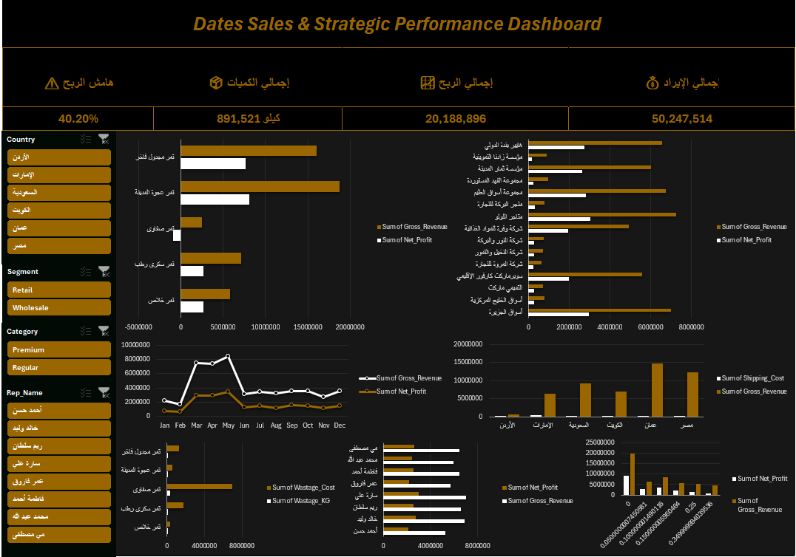

# Dates Company Data Analysis Project

## Documentation

📄 [Full Project Documentation (PDF)](./SOLUTIONS_LOG.pdf)

## Dashboard Preview

## Tools & Technologies
- SQL Server
- Microsoft Excel
- Data Cleaning
- Data Modeling
- Business Intelligence

## Key Business Insights
- Identified UAE shipping cost anomaly
- Optimized discount strategy
- Detected inventory losses in Safawi dates
- Improved profitability visibility using SQL Views

